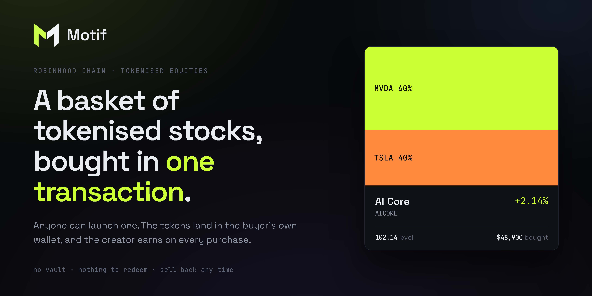

<p align="center">
  
</p>

<p align="center">
  <b>Build an index of tokenised equities. Buy the whole thing in one transaction.</b>
</p>

<p align="center">
  
  
  
  
  
</p>

<p align="center">
  <b>MOTIF</b> · <code>0x89565a7BBfddab021844e2f66a79852e46C802df</code><br/>
  <a href="https://www.ponsfamily.com/launchpad/0x89565a7BBfddab021844e2f66a79852e46C802df">Trade on Pons</a> ·
  <a href="https://motif.fund">motif.fund</a>
</p>

<p align="center">
  <a href="#what-this-is">What this is</a> ·
  <a href="#the-custody-claim">Custody</a> ·
  <a href="#architecture">Architecture</a> ·
  <a href="#running-it">Run it</a> ·
  <a href="docs/02-api.md">API</a> ·
  <a href="#the-token">Token</a> ·
  <a href="#what-it-does-not-do">Limits</a>
</p>

<br />

## What this is

Robinhood Chain carries 95 tokenised equities with live Chainlink price feeds,
and almost nothing is built on top of them. Real world assets were about 4% of
early chain volume: the infrastructure exists and nobody is using it.

Motif is the missing layer. Anyone publishes an index, a list of tickers and
weights written on chain. Anyone else buys that whole index in a single
transaction, and every token lands in the buyer's own wallet.

Launching an index fund in the ordinary world needs an issuer, an authorised
participant, a prospectus and about two years. All of that apparatus exists
because shares sit at a custodian. On this chain they do not, so the whole
structure collapses into arithmetic.

## The custody claim

**Motif never holds anything.** This is structural rather than a promise:

- Uniswap V3 pays swap output to any recipient, so each leg sends its tokens
  straight to the buyer. They never pass through the contract.
- Fees are skimmed from the input and forwarded in the same transaction, so no
  fee balance accrues and there is nothing to withdraw.
- The rebalancer works on an allowance. It pulls only what it sells and returns
  the proceeds in the same transaction. Revoke the allowance and it is
  powerless.
- There is no withdrawal function in either contract, because there is nothing
  to withdraw.

Two tests assert exactly this, checking that the router and the rebalancer hold
a zero balance of every token after a full run.

## What is built

| Piece | What it does |
| --- | --- |
| **`BasketRouter.sol`** | Publish an index. Buy every leg in one transaction, each landing in your own wallet, and sell any part of it back in one more. Per leg minimums, and any leg that misses reverts the whole basket. |
| **`Rebalancer.sol`** | Optional. Keeps a wallet in ratio by allowance. Permissionless keepers, so it does not stop when one machine dies. |
| **`OracleLib.sol`** | Reads Chainlink with an age on every price. Nothing here returns a bare number. |
| **`api/`** | Indexer, REST and websocket. Open, keyless, versioned migrations. |
| **`packages/sdk`** | Typed client for the API plus contract ABIs. Builds transactions, never signs. |
| **`Orders.sol`** | Limit, stop, trailing stop and TWAP, triggered on the pool so they fire when the exchange is shut. |
| **`Guarded.sol`** | A kill switch and a size cap. It cannot move anything. |
| **`web/`** | Next.js app: launch, browse, buy, sell, track. Every motif has its own url and its own link card. |

## Three things that are easy to get wrong

**The venue is not where it looks.** The Uniswap V4 PoolManager on this chain
holds a large NVDA balance, which is why the first version of the router was
written against it. Those are memecoin against stock token pools from the
launchpad. V4 has no USDG paired stock pool at all. The real venue is Uniswap
V3, at a factory that is **not** the canonical mainnet address. A balance in a
venue proves activity, not that your pair is there.

**The oracle is not fresh.** Stock feeds update on price deviation rather than a
heartbeat, and they run 24/5. An NVDA feed was measured **120 minutes stale
while the US market was open**, and across a weekend there is no update at all.
So the contract never reads a price to settle anything. Prices set the per leg
floor on the client and drive display, and every read carries its age.

**A split is not a crash.** Every stock token carries an ERC-8056
`uiMultiplier` that changes on a split or dividend. A two for one split reads
as a 50% drop to anything naive, and a rebalancer would sell the position into
it. Motif records each multiplier at subscribe time and **freezes** rebalancing
when one moves. Only the holder can acknowledge it, never the keeper.

## Architecture

```
Robinhood Chain 4663
  Uniswap V3 factory 0x1f7d7550…      36 USDG paired stock pools
  Chainlink feeds                     54 live aggregators, 8 decimals
        │
        ├── BasketRouter ── buy() ── one tx, N swaps, output to the buyer
        │                  └ sell() ── one tx back out, no fee, no custody
        ├── Rebalancer ──── rebalance() ── allowance only, permissionless keeper
        │
   api/ indexer ── 5,000 block windows ── SQLite ── REST + WS
        │
   web/ Next.js + wagmi          packages/sdk
```

### Urls

Every motif is a page, not a fragment.

```
/                 /explore        /launch     /orders    /portfolio    /how
/m/:id            one motif, with its own title, description and link card
/c/:address       one creator
/sitemap.xml      every motif, so a crawler finds more than the front door
```

This was hash routing until recently, and that was a real mistake rather than a
style choice. A fragment is never sent to a server, so `#motif/3` is invisible
to every crawler and every link unfurler: each of the thousands of motif links
people might post would have shown the same generic card. For something whose
distribution *is* the shared link, that is the product being broken rather than
a detail. Old hash urls still resolve, client side, to the route they meant.

## Running it

Node 20 or newer, and [Foundry](https://getfoundry.sh) for the contracts. No
API key and no funded wallet: the tests and the local stack both run against a
fork of mainnet, which carries the real pools and the real stock tokens.

```bash
git clone --recurse-submodules https://github.com/SeierkDev/Motif
cd motif

# OpenZeppelin is vendored by clone rather than as a submodule, because
# forge install refused to touch .gitmodules with local changes present. It is
# gitignored, so this step is not optional: without it `forge build` cannot
# resolve @openzeppelin/contracts.
git clone --depth 1 --branch v5.4.0 https://github.com/OpenZeppelin/openzeppelin-contracts lib/openzeppelin-contracts

forge test                       # 85 fork tests against mainnet, no key needed

# A pinned fork. A bare `anvil --fork-url` chases the head, asks the public rpc
# for state it has already pruned, and dies mid session. Pinning delays that
# rather than fixing it: the pinned block gets pruned too, usually inside an
# hour, after which anvil accepts transactions and silently mines none. If the
# app appears to hang, re-fork before looking for a bug.
RPC=https://rpc.mainnet.chain.robinhood.com
anvil --fork-url $RPC --compute-units-per-second 200 --fork-block-number $(cast block-number --rpc-url $RPC)

# in another shell
forge script script/Deploy.s.sol:Deploy --rpc-url http://127.0.0.1:8545 --broadcast
scripts/seed-fork.sh             # six motifs, two creators, real buys

cd api && npm install && MOTIF_RPC=http://127.0.0.1:8545 npm start
cd web && npm install && NEXT_PUBLIC_LOCAL=1 npm run dev

node scripts/api-smoke.mjs       # calls every route the api advertises, runs in CI
node scripts/gen-abi.mjs         # regenerate the sdk abis after a signature change
```

A local anvil fork carries the real pools and the real stock tokens, so nothing
has to be mocked and no faucet is needed to develop against it.

Tests run against a fork rather than mocks on purpose. A mock would have passed
happily against the wrong venue, which is exactly the mistake that had to be
caught.

## Deploying it

Two services from one repo. Both carry a `Dockerfile` and a `railway.json`.

**The `railway.json` files are not being read, and cannot be.** Railway
deprecated Config as Code: existing config files keep working until 2026-12-01,
and from 2026-08-28 a service that never used one can no longer opt in. The api
service never did, so its settings live in the dashboard and the dashboard is
the only source of truth. The files are kept as a record of the intended
settings, not as something applied. The giveaway is `healthcheckTimeout`: the
file says 30 and the running service says 300.

Set in the dashboard, and worth knowing why:

- **Serverless off.** Scaling to zero stops the level sweep, and a level is a
  reading of a price that has gone. Every other table can be rebuilt by
  rescanning the chain; that one cannot.
- **One replica.** The api is a single SQLite writer on the mounted volume.
  Railway blocks replicas while a volume is attached, which is the right answer.
- **Watch paths `/api/**`.** The image copies nothing from outside `api/`, so a
  push that only touches `web/` or `docs/` has no reason to rebuild it.

| Service | Root | Needs |
| --- | --- | --- |
| **api** | `api/` | A volume mounted at `DATA_DIR`, and `MOTIF_KEEPER_KEY` |
| **web** | `web/` | The `NEXT_PUBLIC_` values as **build args**, not just variables |

`.env.example` documents every variable and why it matters. Three things are
easy to get wrong and expensive to discover late:

**`DATA_DIR` must be a mounted volume.** It holds the recorded level history,
which is the only state here that cannot be rebuilt. Volume and fees are events
and can be rescanned from the chain forever; a level is a reading of a price
that has gone.

**`MOTIF_KEEPER_KEY` is not optional in production.** Without it nothing fires:
no stop, no limit, no rebalance. The keeper refuses to start rather than
pretending, and `/v1/status` reports `no key`. That wallet needs gas and nothing
else, because every call it makes is an operation a user already authorised
through Permit2 and the contracts hold no balance for it to reach.

**Set it as `0x` and 64 hex digits, with no quotes around it.** A dashboard
variable field is not a shell: quotes typed there are stored as part of the
value. A key that is missing its prefix or still wrapped in quotes is repaired
and logged as something to fix; anything else is refused, and `/v1/status` then
reports `state: "bad key"` with the reason. It is not fatal either way. The
service still comes up and still records levels, which is the only state here
that cannot be rebuilt from the chain later.

**Use a dedicated rpc.** The public endpoint rate limits under real load and is
not an archive node, so a long lived indexer will start seeing 429s and
`metadata is not found`.

The images are written but have not been built here, since this machine has no
Docker. The service itself is verified to start from a clean copy of `api/`
with nothing but environment variables set.

## The token

MOTIF trades on Pons.

**Address** `0x89565a7BBfddab021844e2f66a79852e46C802df` on Robinhood Chain
(4663), 18 decimals, 1,000,000,000 supply.

<https://www.ponsfamily.com/launchpad/0x89565a7BBfddab021844e2f66a79852e46C802df>

**It is not part of the protocol, and that is worth being exact about.** Nothing
in `src/` reads this address. No fee is routed to it, no function checks a
balance of it, and holding it grants no claim on a motif, on a basket token or
on anything the contracts hold, which is nothing in any case. Every contract in
this repository behaves identically whether the token exists or not.

It shares a name with the project and that is the whole of the relationship.
Anyone auditing the custody claim above should be able to confirm that by
grepping for the address and finding it only here and in `web/lib/contracts.ts`,
where it exists to render one link in the footer.

## What it does not do

**Stock tokens are not shares.** They are tokenised debt securities issued
against an equity. They give price exposure, not ownership and not a vote.

**It is not audited.** There is no audit budget. The contracts are small, hold
nothing, and have no admin withdrawal path, which bounds the damage rather than
eliminating it. A review pass before mainnet found one critical bug, and there
will be others. The full write up is in [docs/03-threat-model.md](docs/03-threat-model.md),
including the accepted risks. Read them before you use this.

**There is a guardian during the review window.** One address can pause the
contracts and cap how much a single call may move, currently 25,000 USDG. It
cannot move tokens, take a fee or change an index, because nothing is held for
it to reach. `renounceGuardian` removes it permanently and is meant to be used.

**The rebalancer needs an allowance.** That allowance is a standing permission.
It is bounded by your own settings and revocable at any moment, but it is real,
and it is the one place where you are trusting code rather than holding
everything yourself.

**Liquidity is thin.** Twelve tickers have a usable USDG pool. Roughly 65,000
NVDA shares exist on chain in total. This is early, not established.

## Contributing, and reporting a hole in it

[CONTRIBUTING.md](CONTRIBUTING.md) is short and mostly about the one house rule
that matters: measure it against the chain rather than asserting it, because
most of the real bugs in this repository were found that way and none of them
were found by reading the code harder.

If you have found something that lets you take money that is not yours, please
do not open an issue for it. [SECURITY.md](SECURITY.md) says how to report it
privately.

## License

MIT, in [LICENSE](LICENSE). Fork it, run it, point it at other venues. If a
number here does not reconcile against a source you trust, that is worth an
issue more than a star.
